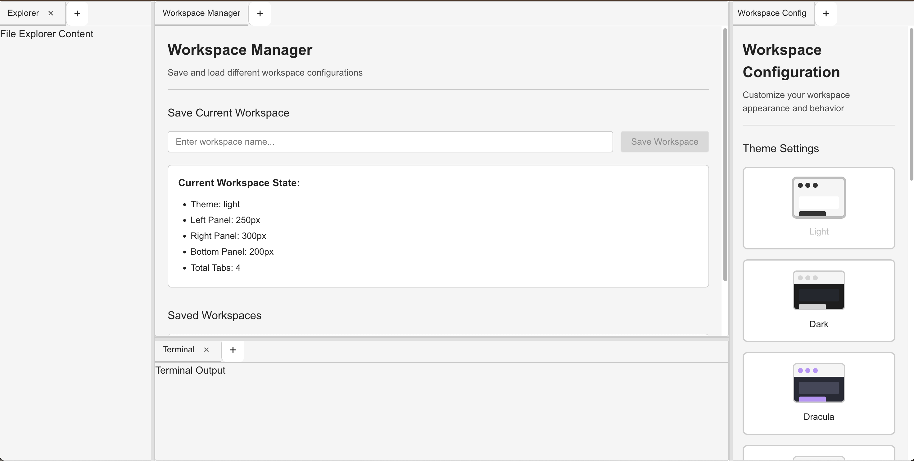

# App Shell

[](https://www.npmjs.com/package/@aesgraph/app-shell)
[](https://app-shell-aesgraph.vercel.app)

A flexible, resizable workspace shell component for React applications with tab management, theme support, and customizable layouts.



## Live Demo

🚀 **[Try the live demo on Vercel](https://app-shell-aesgraph.vercel.app)**

## Installation

```bash
npm install app-shell
```

## Running Locally

To run the app locally for development or testing:

```bash
# Clone the repository (if you haven't already)
git clone https://github.com/aesgraph/app-shell.git
cd app-shell

# Install dependencies
npm install

# Start the development server
npm run dev
```

This will start the app on [http://localhost:5173](http://localhost:5173) (or the port shown in your terminal). You can now view and develop the app in your browser.

## Usage

### Basic Setup

```tsx
import React from "react";
import { WorkspaceProvider, Workspace } from "app-shell";

function App() {
  return (
    <WorkspaceProvider>
      <Workspace />
    </WorkspaceProvider>
  );
}
```

### With Custom Configuration

```tsx
import React from "react";
import { WorkspaceProvider, Workspace } from "app-shell";

function App() {
  const initialConfig = {
    leftPane: {
      defaultSize: 250,
      minSize: 200,
      maxSize: 400,
    },
    rightPane: {
      defaultSize: 300,
      minSize: 250,
      maxSize: 500,
    },
    bottomPane: {
      defaultSize: 200,
      minSize: 150,
      maxSize: 400,
    },
  };

  return (
    <WorkspaceProvider initialConfig={initialConfig}>
      <Workspace />
    </WorkspaceProvider>
  );
}
```

### Components

- `Workspace` - Main workspace component
- `WorkspaceProvider` - Context provider for workspace state
- `Pane` - Individual resizable pane
- `TabContainer` - Container for tabs
- `Tab` - Individual tab component
- `ViewDropdown` - Dropdown for adding new views

### Hooks

- `useWorkspace()` - Hook to access workspace context

### Types

- `WorkspaceConfig` - Configuration interface
- `ThemeId` - Theme type definitions
- `ViewRegistry` - View registry types

## Themes

The workspace supports multiple terminal-inspired themes that can be customized and extended.

### Available Themes

The workspace comes with 10 built-in themes:

- **Light** - Clean light theme with dark text
- **Dark** - Classic dark theme (default)
- **Dracula** - Purple-accented dark theme
- **One Dark** - Blue-accented dark theme
- **Solarized** - Blue-green theme
- **Monokai** - High contrast with pink accents
- **Nord** - Cool blue-gray theme
- **Gruvbox** - Warm brown theme
- **Tokyo** - Blue-purple theme
- **Catppuccin** - Soft purple theme

### Using Themes

#### Programmatic Theme Switching

```tsx
import React from "react";
import { WorkspaceProvider, useWorkspace } from "app-shell";

function App() {
  const { currentTheme, setCurrentTheme } = useWorkspace();

  return (
    <WorkspaceProvider>
      <div>
        <select
          value={currentTheme}
          onChange={(e) => setCurrentTheme(e.target.value)}
        >
          <option value="dark">Dark</option>
          <option value="light">Light</option>
          <option value="dracula">Dracula</option>
          <option value="oneDark">One Dark</option>
          <option value="solarized">Solarized</option>
          <option value="monokai">Monokai</option>
        </select>
        <Workspace />
      </div>
    </WorkspaceProvider>
  );
}
```

#### Initial Theme Configuration

```tsx
import React from "react";
import { WorkspaceProvider, Workspace } from "app-shell";

function App() {
  const workspaceConfig = {
    theme: "dracula", // Set initial theme
    // ... other config
  };

  return (
    <WorkspaceProvider initialConfig={workspaceConfig}>
      <Workspace />
    </WorkspaceProvider>
  );
}
```

### Custom Themes

You can create custom themes by extending the theme system. Note: This feature requires the theme system to be properly configured in your project.

```tsx
import { registerTheme } from "app-shell";

registerTheme({
  id: "my-custom-theme",
  name: "My Custom Theme",
  colors: {
    primary: "#ff6b6b",
    secondary: "#4ecdc4",
    accent: "#45b7d1",
    background: "#2c3e50",
    backgroundSecondary: "#34495e",
    backgroundTertiary: "#3a4a5c",
    surface: "#34495e",
    surfaceHover: "#4a5f7a",
    surfaceActive: "#5a6f8a",
    text: "#ecf0f1",
    textSecondary: "#bdc3c7",
    textMuted: "#95a5a6",
    textInverse: "#2c3e50",
    border: "#34495e",
    borderFocus: "#3498db",
    borderHover: "#4a5f7a",
    success: "#27ae60",
    warning: "#f39c12",
    error: "#e74c3c",
    info: "#3498db",
    link: "#3498db",
    linkHover: "#2980b9",
    workspaceBackground: "#2c3e50",
    workspacePanel: "#34495e",
    workspaceTitleBackground: "#34495e",
    workspaceTitleText: "#ecf0f1",
    workspaceResizer: "#34495e",
    workspaceResizerHover: "#4a5f7a",
    workspaceScrollbar: "#4a5f7a",
    workspaceScrollbarHover: "#5a6f8a",
  },
  sizes: {
    spacing: {
      xs: "4px",
      sm: "8px",
      md: "16px",
      lg: "24px",
      xl: "32px",
      xxl: "48px",
    },
    borderRadius: {
      none: "0",
      sm: "2px",
      md: "4px",
      lg: "8px",
      full: "9999px",
    },
    fontSize: {
      xs: "12px",
      sm: "14px",
      md: "16px",
      lg: "18px",
      xl: "20px",
      xxl: "24px",
    },
    shadow: {
      none: "none",
      sm: "0 1px 2px rgba(0, 0, 0, 0.05)",
      md: "0 4px 6px rgba(0, 0, 0, 0.1)",
      lg: "0 10px 15px rgba(0, 0, 0, 0.1)",
      xl: "0 20px 25px rgba(0, 0, 0, 0.15)",
    },
  },
});
```

## Registering Custom Views

You can add your own custom views to the workspace using the `registerViews` API. This allows you to extend the workspace with your own components.

### Basic View Registration

```tsx
import React from "react";
import { registerViews, WorkspaceProvider, Workspace } from "app-shell";

// Define your custom view
const MyCustomView = () => <div>My Custom View Content</div>;

registerViews([
  {
    id: "my-custom-view",
    title: "My Custom View",
    component: MyCustomView,
    icon: "🔧",
    category: "custom",
  },
]);

function App() {
  return (
    <WorkspaceProvider>
      <Workspace />
    </WorkspaceProvider>
  );
}
```

### Advanced View Configuration

```tsx
registerViews([
  {
    id: "advanced-view",
    title: "Advanced View",
    description: "A more complex view with additional features",
    component: AdvancedView,
    icon: "⚡",
    category: "development",
    closable: true,
    defaultActive: false,
  },
]);
```

### View Categories

Organize your views into categories for better organization:

```tsx
registerViews([
  {
    id: "file-explorer",
    title: "File Explorer",
    component: FileExplorer,
    icon: "📁",
    category: "navigation",
  },
  {
    id: "terminal",
    title: "Terminal",
    component: Terminal,
    icon: "💻",
    category: "development",
  },
  {
    id: "settings",
    title: "Settings",
    component: Settings,
    icon: "⚙️",
    category: "configuration",
  },
]);
```

### Managing Registered Views

You can access and register the built-in views using the `defaultViews` export:

```tsx
import { registerViews, defaultViews } from "app-shell";

// Register all default views
registerViews(defaultViews);

// Or combine default and custom views
registerViews([
  ...defaultViews,
  {
    id: "my-custom-view",
    title: "My Custom View",
    component: MyCustomView,
    icon: "🔧",
    category: "custom",
  },
]);
```

To remove all registered views, use:

```tsx
import { clearViews } from "app-shell";

clearViews();
```

## Development

```bash
# Install dependencies
npm install

# Start development server
npm run dev

# Build library
npm run build-lib

# Build for production
npm run build
```

## Security

This project includes automated security scanning to prevent accidental exposure of sensitive information:

### Security Checks

- **TruffleHog**: Scans for verified secrets and API keys
- **Gitleaks**: Detects hardcoded secrets and credentials
- **Pattern Matching**: Checks for common secret patterns
- **File Scanning**: Prevents .env files from being committed
- **Token Detection**: Identifies various service tokens (GitHub, npm, AWS, etc.)

### Security Workflow

The security scan runs automatically on:

- All pushes to `main` and `develop` branches
- All pull requests to `main` and `develop` branches

### What Gets Scanned

- API keys and secrets
- Access tokens
- Private keys
- Environment files (.env\*)
- Hardcoded credentials
- Service-specific tokens (GitHub, npm, AWS, etc.)

### If Secrets Are Found

If the security scan detects potential secrets:

1. The workflow will fail
2. Review the findings in the GitHub Actions logs
3. Remove any actual secrets from the codebase
4. Use environment variables or secure secret management instead

### Commit Message Format

This project uses [semantic-release](https://github.com/semantic-release/semantic-release) for automated versioning and releases. To ensure proper release detection, commit messages must follow the [Conventional Commits](https://www.conventionalcommits.org/) specification.

#### Required Commit Prefixes

- `feat:` - New features (triggers minor version bump)
- `fix:` - Bug fixes (triggers patch version bump)
- `perf:` - Performance improvements (triggers patch version bump)
- `BREAKING CHANGE:` - Breaking changes (triggers major version bump)
- `docs:` - Documentation changes (no version bump)
- `style:` - Code style changes (no version bump)
- `refactor:` - Code refactoring (no version bump)
- `test:` - Adding or updating tests (no version bump)
- `chore:` - Maintenance tasks (no version bump)

#### Examples

```bash
# New feature
git commit -m "feat: add dark theme support"

# Bug fix
git commit -m "fix: resolve tab dragging issue"

# Breaking change
git commit -m "feat: redesign workspace layout

BREAKING CHANGE: Workspace component API has changed"

# Style changes (no release)
git commit -m "style: improve button spacing"

# Documentation (no release)
git commit -m "docs: update installation instructions"
```

**Note:** Commits without these prefixes (like "style improvements" or "update code") will not trigger semantic-release and won't create new versions.

## License

MIT
